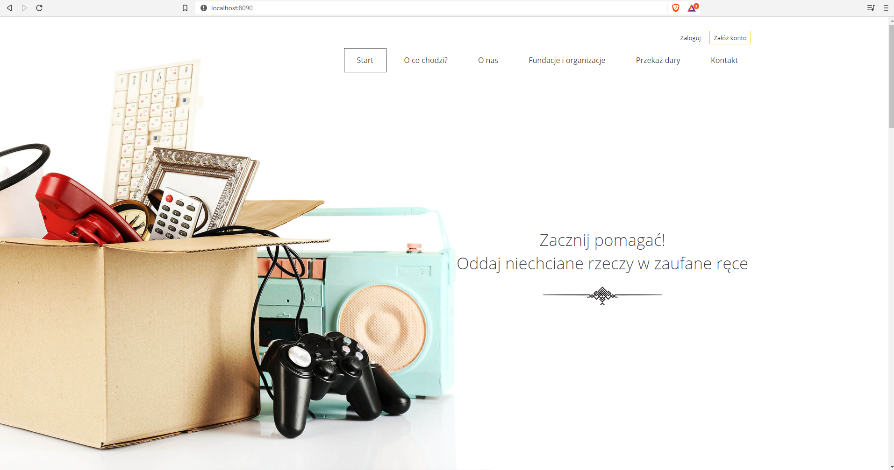
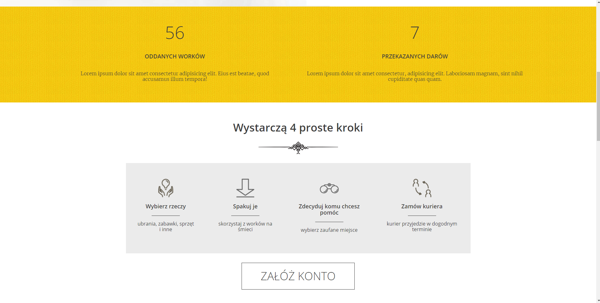
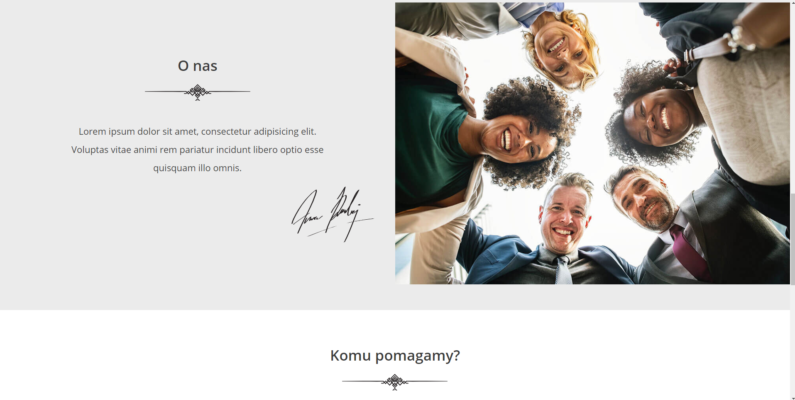
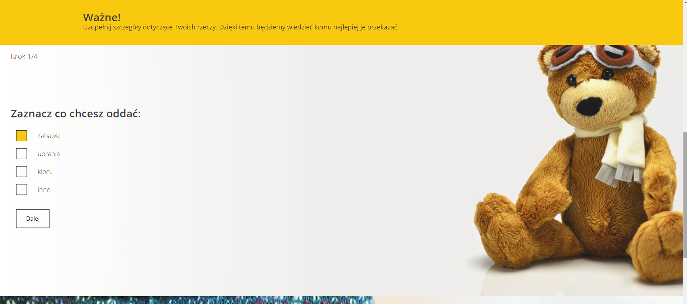
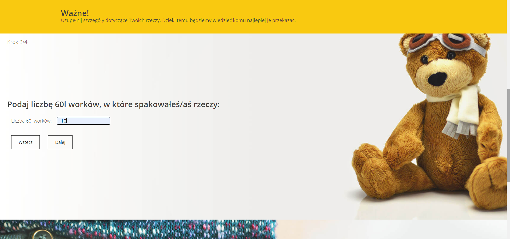
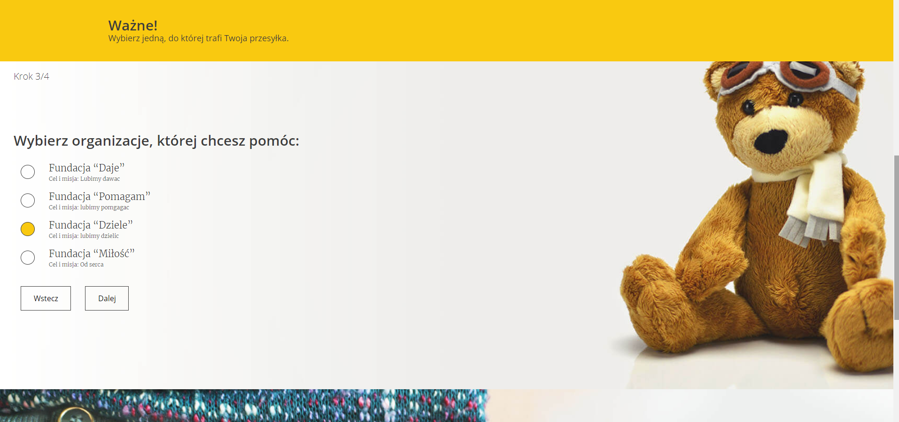
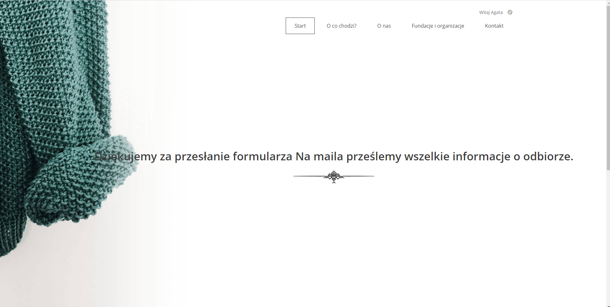

## About Aplication:
````
The goal of the project is to create a place where everyone can donate unnecessary things to trusted institutions.
````
````
Current development status of the application on the branch called - develop
Project status: work in progress
````

## Functionalities:

````
1. Administrator profile:
 - logging in
 - management of CRUD administrators,
 - CRUD management of trusted institutions,
 - viewing, editing, deleting registered users,
 - an overview of the donations.
- the possibility of defining the status of gifts (submitted / received / given)
````
````
2. User profile:
 - registration,
 - logging in (the same form as for the administrator),
 - editing your own profile (basic data),
 - adding gifts only after logging in,
 - viewing, editing, deleting donations,
 - indicating that the gift has been given to someone (archiving).
 ````
````
3. Users
- user roles (ROLE_USER, ROLE_ADMIN)
- admin panel based on a ready ** Sb Admin ** template
````
````
4. CRUD
- four basic functions for managing it in applications that use persistent memory.
````

````
5. Additional functionalities
- confirmation of account activation via a message sent to the email provided during registration,
- support for forgotten passwords,
- validation of correct input of two identical passwords,
- administrator service validation (e.g. no possibility to delete the last existing administrator).
````

## Languages and Tools Used:

````
- Java
- Spring Boot
- Spring Form
- Hibernate
- Spring Data JPA
- Lombok
- Maven
- Git
- MySQL
- JSP
````


## Job distribution tools:


````
````

## Page layout:


````
````

````
````

````
````

````
````

````
````

````
````

````
````

````
````

````
````

````
````
